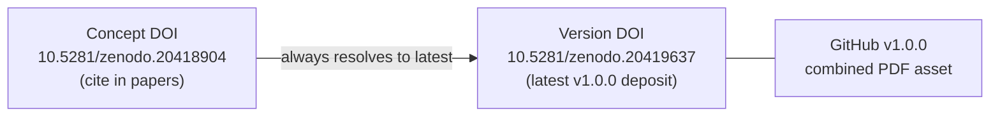

# Zenodo DOI strategy — concept vs version chain

This project uses Zenodo’s **concept DOI + version DOI** model so citations stay stable while deposits remain auditable.

## The two DOI roles

| Field | Config key | Purpose | Changes when you re-deposit? |
| --- | --- | --- | --- |
| **Citation DOI (concept)** | `publication.doi` | What readers cite; resolves to the latest version | **Never** (after first concept mint) |
| **Latest deposit DOI (version)** | `publication.version_doi` | Pinpoints the exact file set on Zenodo | **Yes** — each `--new-version` upload mints a new one |
| **Latest record URL** | `publication.version_record` | Human-readable “current deposit” link | **Yes** — update with each upload |

### This release (v1.0.0)

| Role | Identifier |
| --- | --- |
| Concept record | https://zenodo.org/records/20418904 |
| **Cite this DOI** | https://doi.org/10.5281/zenodo.20418904 |
| Latest version record (v1.0.0) | https://zenodo.org/records/20419637 |
| Latest version DOI | https://doi.org/10.5281/zenodo.20419637 |
| GitHub release | https://github.com/ActiveInferenceInstitute/policy_entanglement/releases/tag/v1.0.0 |



## Where each DOI appears

| Surface | DOI used |
| --- | --- |
| `CITATION.cff`, README, abstract, PDF cover | **Concept** (`publication.doi`) |
| `docs/RELEASE_v1.0.0.md`, release receipts | **Both** — concept for citation, version for deposit audit |
| Zenodo deposit metadata | Version DOI of that upload |
| `publication_metadata.py` gates | Both — concept in prose paths; `version_doi` / `version_record` in config |

## Publishing workflow (no DOI drift)

1. **Render PDF** — cover reads `publication.doi` (concept); no rebuild needed after version bumps.
2. **Upload** — `publish_project_release.py --production --new-version` (from the template monorepo):
   ```bash
   cp output/pdf/actinf_policy_entanglement_lean_combined.pdf \
      ../template/output/actinf_policy_entanglement_lean/pdf/
   uv run python scripts/publish_project_release.py \
     --project actinf_policy_entanglement_lean \
     --tag v1.0.0 \
     --repo ActiveInferenceInstitute/policy_entanglement \
     --production --new-version --skip-github --skip-rerender
   ```
3. **Write-back** — when `version_doi:` is present in config, the template only updates `version_doi` + `version_record`; **`publication.doi` is left unchanged**.
4. **Sync gates** — update `CANONICAL_VERSION_DOI` / `CANONICAL_VERSION_RECORD` in `src/manuscript/publication_metadata.py` and the version rows in `docs/RELEASE_v1.0.0.md`.
5. **GitHub** — upload `actinf_policy_entanglement_lean_combined.pdf` to the matching tag; keep a **single** PDF asset on the release.

## Chain confirmation checklist

After any deposit, confirm:

- [ ] https://doi.org/10.5281/zenodo.20418904 resolves to the concept record (20418904).
- [ ] `publication.version_doi` matches the newest published version DOI on Zenodo.
- [ ] `publication.version_record` matches `https://zenodo.org/records/<version-id>`.
- [ ] GitHub release asset SHA-256 matches `docs/RELEASE_v1.0.0.md` (or receipt).
- [ ] `uv run python -c "… publication_metadata_issues …"` returns no issues.

## Why not put the version DOI on the cover?

Each Zenodo version upload mints a **new** version DOI. Putting that on the PDF cover forces a render → upload → new DOI loop. The concept DOI is stable; Zenodo’s resolver forwards citations to the latest version automatically.
