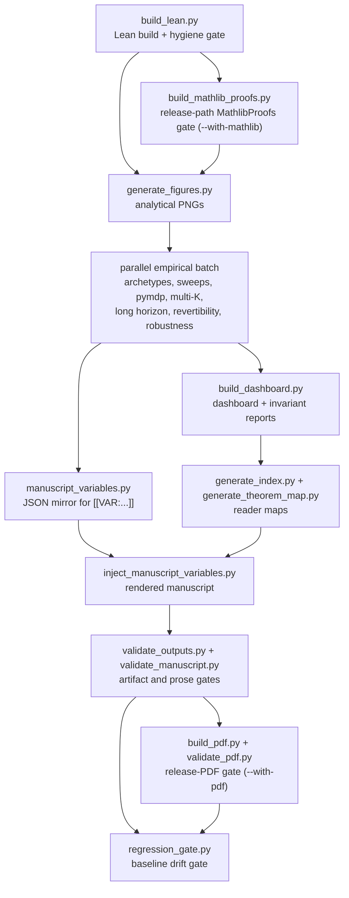

# Methods Orchestration and Figure Provenance

*Latest generated audit.*

This page explains how a fresh run turns source files into manuscript
claims. It is written for reviewers who want to audit the methods
without reverse-engineering the scripts.

## The Contract

The pipeline has one job: make the rendered manuscript a consequence
of code, data, and registries, not hand-maintained prose. The contract
is:

1. Lean builds before theorem tables are trusted.
2. Empirical producers write their CSV, JSON, PNG, and JSONL artifacts.
3. `manuscript_variables.py` runs after empirical sidecars exist, so
   injected values come from the current run rather than stale files.
4. `inject_manuscript_variables.py` renders prose only after the JSON
   mirror is complete.
5. Output, manuscript, and regression gates fail the run on drift.

## Dependency Shape



`run_all.py` runs the empirical producers as a parallel-eligible batch
because they are write-isolated. The variable renderer deliberately
stays outside that batch: it reads summaries from the empirical stages,
including `multi_k_summary.json`, `long_horizon_summary.json`, and
`revertibility_summary.json`, plus the shipped BTAI and adversarial
sidecars.

## Stage Groups

| Group | Scripts | Why the order matters |
|---|---|---|
| Formal prelude | `build_lean.py` | The Lean budget is checked before generated theorem maps can be believed. |
| Analytical figures | `generate_figures.py` | Pure-NumPy figures do not depend on pymdp sidecars, so they can run early. |
| Empirical producers | `dump_archetypes.py`, `parameter_sweep.py`, `simulate_pymdp.py`, `simulate_multi_k.py`, `simulate_long_horizon.py`, `simulate_revertibility.py`, `simulate_robustness.py`, `simulate_btai.py`, `simulate_adversarial.py`, `simulate_gnn.py` | These write independent outputs and can run concurrently. |
| Variable materialization | `manuscript_variables.py` | Reads hyperparameters and the current empirical sidecar summaries, then writes `output/data/manuscript_variables.json`. |
| Reader artifacts | `build_dashboard.py`, `generate_index.py`, `generate_theorem_map.py` | Builds the dashboard, manuscript index, and four-track theorem map after data exists. |
| Rendering | `inject_manuscript_variables.py` | Resolves `[[VAR:...]]`, `[[FIG:...]]`, `[[THMREF:...]]`, citations, and equation numbers. |
| Gates | `validate_outputs.py`, `validate_manuscript.py`, `regression_gate.py` | Validates files, prose, links, ranges, and baseline drift. |
| Release PDF | `build_pdf.py`, `validate_pdf.py` | Optional `run_all.py --with-pdf` path: renders with local Pandoc/XeLaTeX/BibTeX tooling and scans PDF text, TeX, logs, and margins. |
| MathlibProofs analytic layer | `build_mathlib_proofs.py` | Optional `run_all.py --with-mathlib` path: checks the separate Mathlib package, records the result in the manifest/readiness reports, and gates the headline real-valued decomposition claim while leaving the stock-Lean boundary Mathlib-free. |

## Figure Provenance

Every plotting helper saves through
`src/visualizations/_io.py::_save_with_metadata`. Each PNG carries a
`project.*` tEXt block:

| Metadata key | Meaning |
|---|---|
| `project.source_script` / `project.source_function` | Which script and figure function created the PNG. |
| `project.hyperparameters` | The grid, seed, lambda range, observation, or stream-count snapshot passed by the script. |
| `project.uncertainty_semantics` | The caption-facing uncertainty class: deterministic grid, canonical fixed seed, replicate envelope, confidence interval, or analytical schematic. |
| `project.figure_statistics` | Schema-v2 compact layout and data summaries: figure size, DPI, axes labels, limits, line summaries, image summaries, collection summaries, legend labels, and actual font sizes for titles, axes, ticks, legends, stat boxes, and provenance text. |
| `project.git_revision` / `project.timestamp` | Run provenance; these are the intentional non-bit-stable fields. |

The manuscript uses this metadata in two ways. Captions name the
statistical object being visualized, while validators check that PNGs
exist, are readable, carry project provenance, and meet publication
font minima. The metadata does not embed full plotted arrays; it stores
summaries large enough for an audit and small enough to keep PNGs
portable.

## PDF Release Gate

The project-local PDF commands are:

```bash
uv run python scripts/build_pdf.py
uv run python scripts/validate_pdf.py
```

`build_pdf.py` regenerates `output/manuscript/`, combines the injected
sections, converts them to `_combined_manuscript.tex` with Pandoc, and
runs XeLaTeX/BibTeX locally. `validate_pdf.py` then scans the combined
PDF text, `_combined_manuscript.md`, TeX, and LaTeX log. It fails on
unresolved missing-token markers, raw `$`
delimiters in extracted PDF text, undefined references/citations, LaTeX
warnings/errors, missing glyphs, stale draft/Mathlib wording, and drift
from the compact margin contract in `manuscript/preamble.md`.

The full release pipeline is:

```bash
uv run python scripts/run_all.py --with-pdf --with-mathlib
```

The `--with-mathlib` stage is a release subgate for the separate
analytic package. It does not alter the default Mathlib-free boundary
build. It does support the registered headline $\mathbb{R}$ discharge
when the keystone declarations and axiom audit pass; other witness rows
still require their own compiled Mathlib source and registry updates
before promotion.

## Manuscript Injection Path

Numeric claims enter prose through this path:

```text
src/simulation/hyperparameters.py
        + empirical sidecars under output/data and output/simulations
        -> scripts/manuscript_variables.py
        -> output/data/manuscript_variables.json
        -> [[VAR:key]] tokens in manuscript/*.md
        -> output/manuscript/*.md
        -> validate_manuscript.py
```

The practical rule is simple: change a grid, seed, sweep, horizon,
tolerance, or figure sentinel in `src/simulation/hyperparameters.py`;
let the scripts regenerate the sidecars; then let
`manuscript_variables.py` mirror the values. Hand-typed numeric claims
in manuscript prose are treated as validation failures.

## Mathlib4 Integration Path

Mathlib4 belongs after the current boundary fragment, not inside it.
The current Lean package defines names, witness structures, and
algebraic boundary identities in stock Lean. The separate Mathlib4 layer
under `lean/MathlibProofs/` imports Mathlib and discharges the headline
real-valued decomposition through `free_energy_decomposition_full` and
`entanglement_decomposition_generalK`; it is also the place where
future row-specific witness payloads should be constructed from Mathlib
lemmas.

| Integration checkpoint | Input | Output | Validation |
|---|---|---|---|
| Boundary build | `lean/ActinfPolicyEntanglement/` | Stable witness record names and theorem signatures | `uv run python scripts/build_lean.py` |
| Headline Mathlib discharge | finite real-valued PMFs, finite sums, log/exp, entropy, KL | `free_energy_decomposition_full` plus the general-K finite-KL kernel | `uv run python scripts/build_mathlib_proofs.py`; foundational-only `#print axioms`; negative-control checks |
| Witness construction | Mathlib lemmas plus project-local adapters | inhabitants of the current witness structures | Lean type-checker; no witness-row status change before row-specific green source |
| Registry promotion | `manuscript/refs/labels.yaml` rows | status changes from `witness` to `proved` where appropriate | `generate_theorem_map.py` exhaustiveness check + `validate_manuscript.py` |
| Manuscript discussion | `[[LEAN:...]]`, `[[THMREF:...]]`, and generated theorem map rows | rendered source snippets and accurate proof-status prose | PDF render + token scan + link audit |

The recommended proof-engineering order is encoded in the generated
theorem map. Start with finite KL and total-correlation identities
(`prop_11_3`, `prop_6_3`, `thm_4_1`, `prop_6_5`), then the real
log-partition/convexity/Taylor rows (`thm_4_2`, `thm_4_3`,
`prop_10_1`, `thm_8_1`, `cor_8_2`), then matrix-rank rows
(`prop_7_1`, `prop_7_2`, `thm_7_3`). Hierarchical concentration and
recursive sophisticated-inference embedding should follow after the
finite and convex foundations exist, because those rows require
project-local limit and recursive-policy infrastructure.

This checkpoint structure prevents two common failures: treating a
Mathlib sketch as current source, and silently promoting a witness row
without a compiled additive proof. The current manuscript may cite the
compiled MathlibProofs headline discharge, the stock-Lean boundary
declarations, and the generated readiness map; other witness payloads
remain roadmap until `lean/MathlibProofs/` contains row-specific green
source for them.

## Debugging Drift

| Symptom | First place to look |
|---|---|
| A rendered number is stale | Confirm `run_all.py` ran the empirical producer before `manuscript_variables.py`, then inspect `output/data/manuscript_variables.json`. |
| A figure exists but a caption disagrees | Inspect `project.hyperparameters`, `project.uncertainty_semantics`, and `project.figure_statistics` with `visualizations.metadata.read_figure_metadata`. |
| The PDF shows a raw `$`, `??`, or missing-token marker | Run `scripts/validate_pdf.py`, then inspect `output/pdf/_combined_manuscript.log`. |
| A theorem row looks stale | Re-run `generate_theorem_map.py`; then inspect `manuscript/refs/labels.yaml`. |
| A run passes locally but claims regressed | Run `regression_gate.py`; update `regression_baseline.json` only for an intentional release baseline. |
